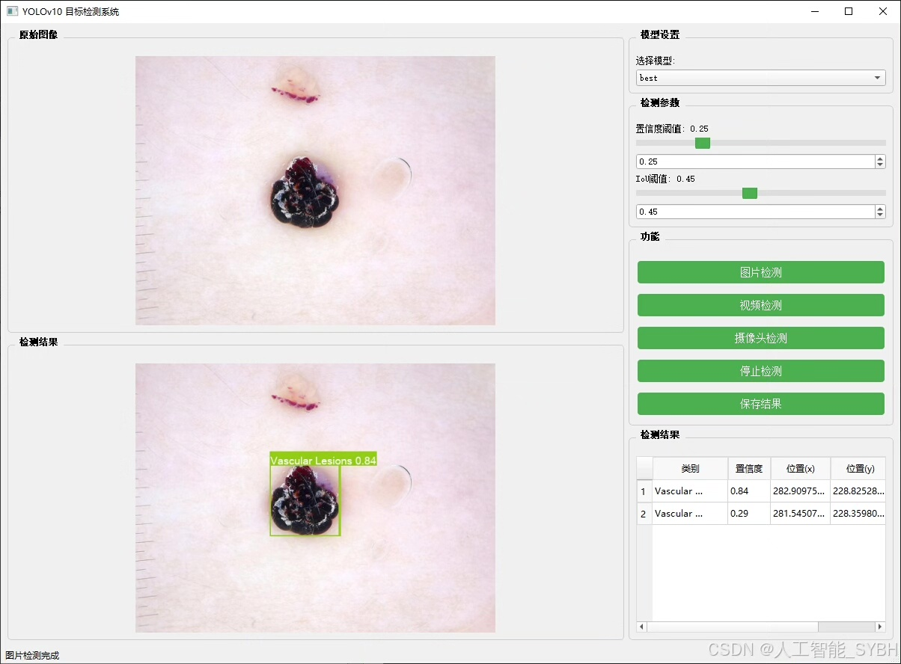
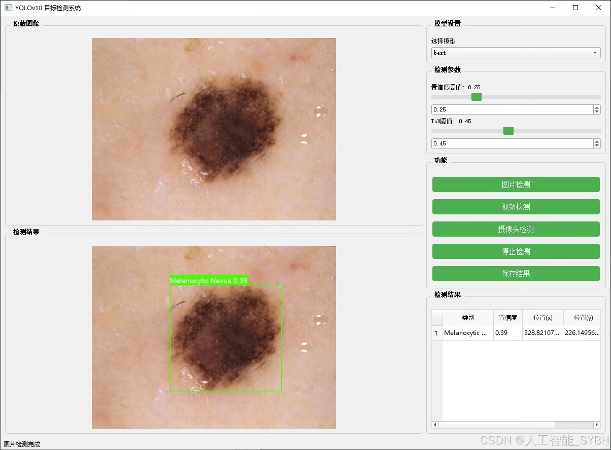
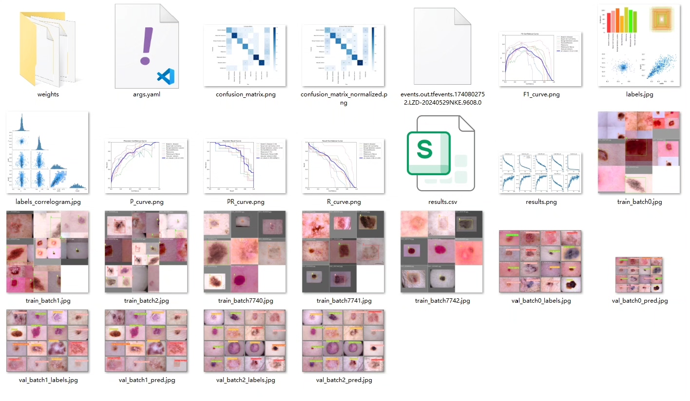
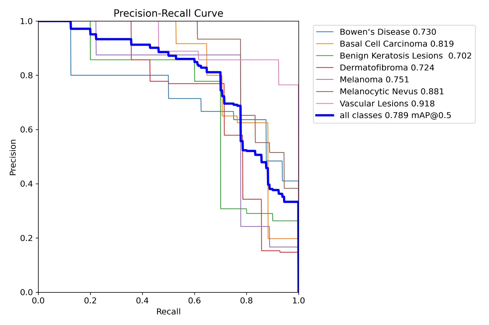
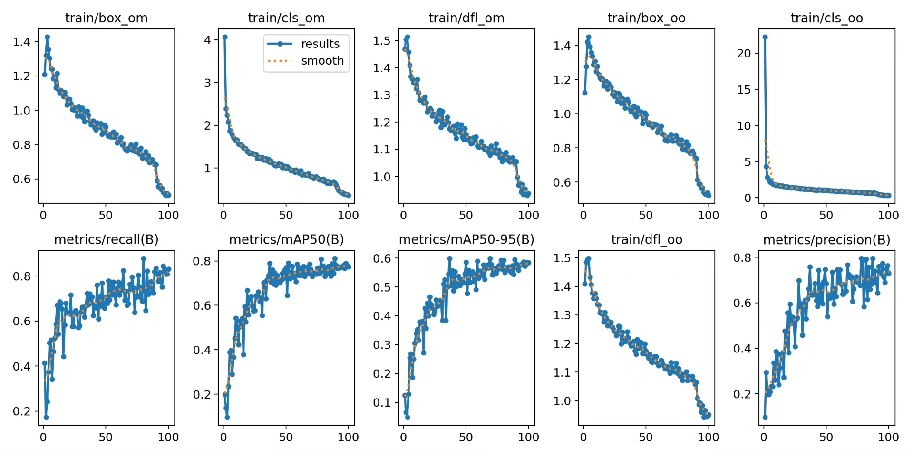
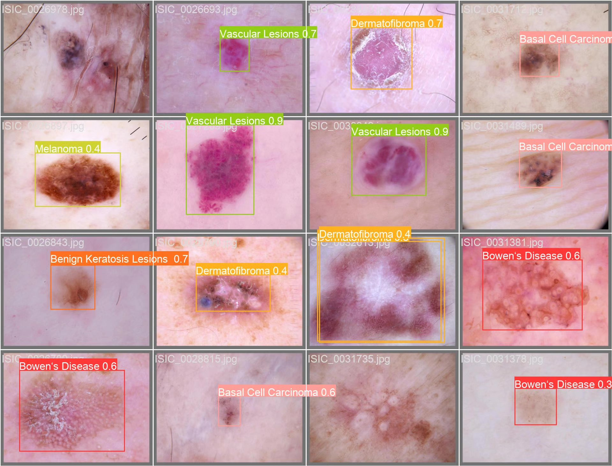
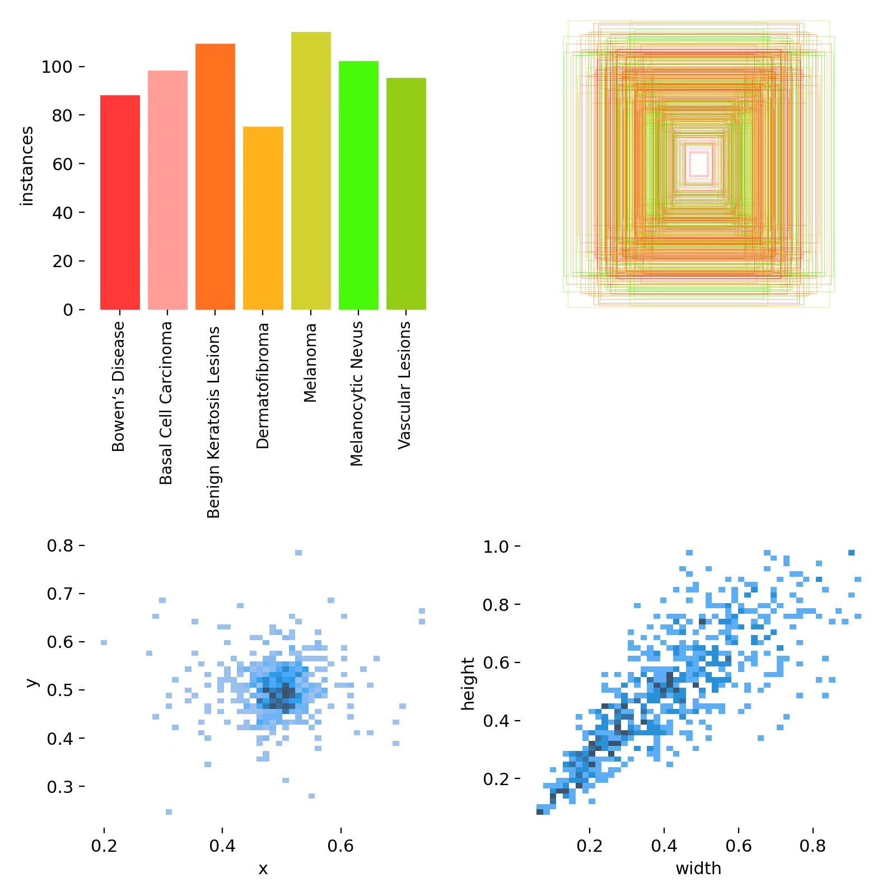
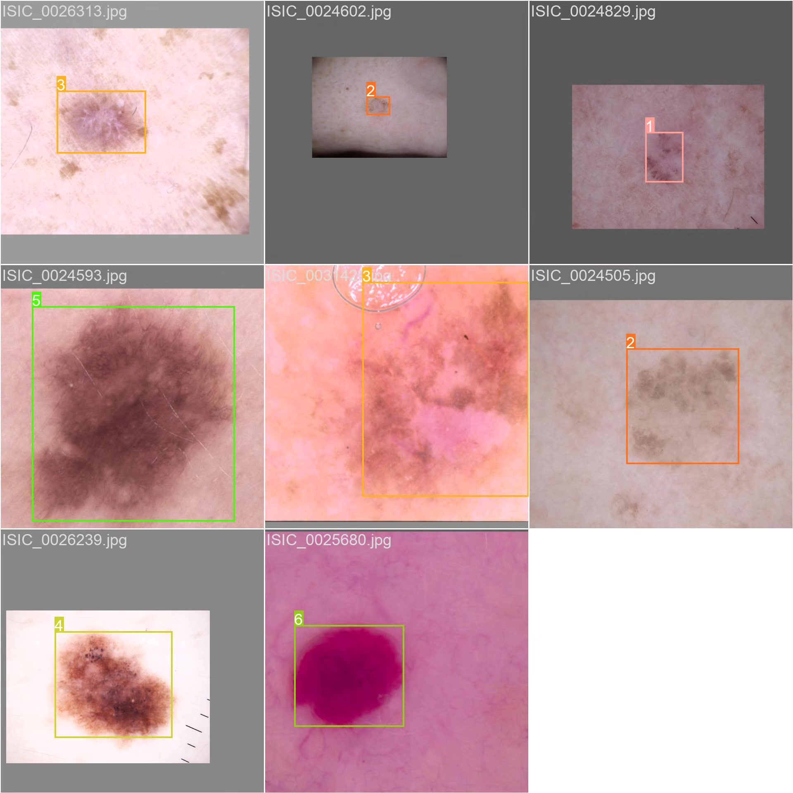

# Based on deep learning YOLOv10 for skin disease detection system (YOLOv1)

## Body

Based on deep learning YOLOv10, a skin disease detection system (YOLOv10+YOLO dataset + UI interface + Python project source code + model)

Deep learning target detection technology (such as YOLO series) has made significant progress in the field of medical image analysis. YOLOv10, as the latest version of the YOLO series, has higher detection speed and accuracy, which is very suitable for the scene of skin disease detection. The purpose of this project is to use the YOLOv10 algorithm, combined with skin disease image data, to develop a high-efficiency and accurate skin disease detection system, providing intelligent support for skin disease diagnosis.

The company's products have obtained the official commercial license certification of YOLO.

Service after payment: After payment, we will provide WeChat ID, answer questions anytime.

Environment configuration: We will provide an environment configuration tutorial, and WeChat provides Q&A.

Remote installation service: If you need remote configuration, additional payment of 69 is required,
If the configuration fails, all fees are refunded (specially old computers only refund installation fees).

Retraining dataset: After configuring the environment, you can train on your own computer.
If you need us to retrain, just pay 69+ computing power fee (2.5 yuan/hour)

Full package of after-sales service

## Images

## Payment

Here is a pay link on Stripe ( https://buy.stripe.com/3cs8yP7sY87d0vu9AB ). Please contact me lonlonago@foxmail.com after funding $89, and I will send you a complete data files , thank you!

